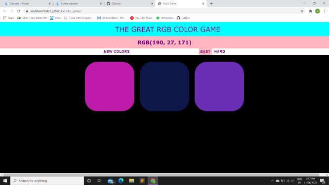
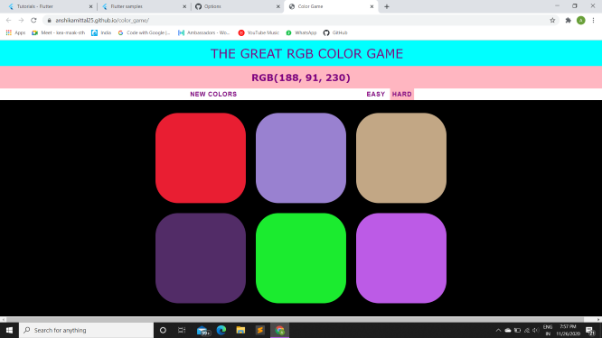

1. This RGB color game was created using HTML, CSS and JavaScript. 
2. It has two levels easy and hard.
3. The user needs to guess the color from the options that the given RGB format depicts.
4. It helps the user to get an idea of RGB color formats while playing.

